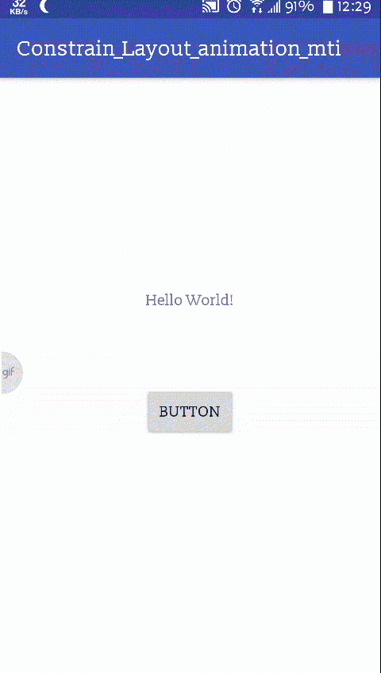
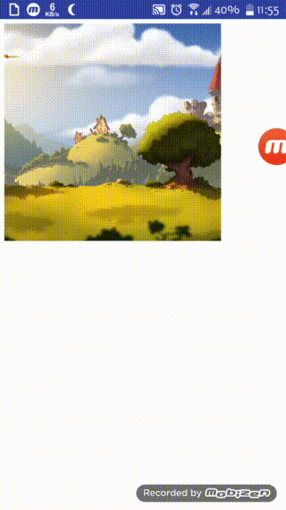
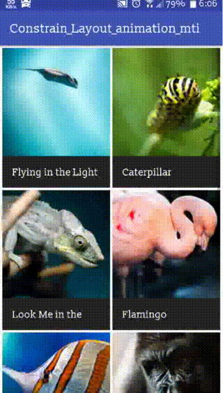

# Layout_animation
This is quick example of layout constrain Animation.

## Quick Transition Anim using Transition Manager Branch_1.1

## Constraint Layout Animation using Scene And Transition API Branch_1.x

## Scene Layout Transition Anim using Scene and Transition API Branch_1.x.C

## Scene and Transition Api Branch_02

## Activity Content transition Animation with Staggered RecyclerView(Which acts as random GridView)  Branch_03 

## Shared Element Activity transition Animation Branch_04

